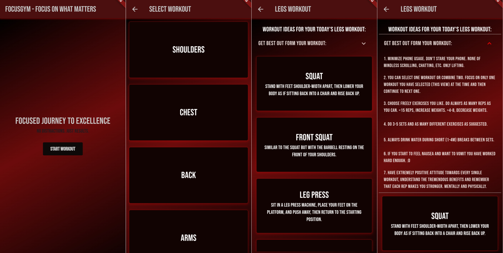

# FocusGym™

Simple flutter cross-platform application for focused workouts. Applicaitons is giving the user workout tips, and exercise ideas and opening google images search to see exercise quickly by search if not familiar with it. There is not any backend yet, but possibly adding later firebase/supabase backend and additional features, like saving exercieses etc.

Iof you are interested or want to use the application for your workouts, please check the web version of this application here:
https://focusgym.vercel.app

Or install the android APK from here:
https://drive.google.com/file/d/1i3--r7akVvl8LrGjIDUZeU1K6pWD84md/view?usp=drive_link

